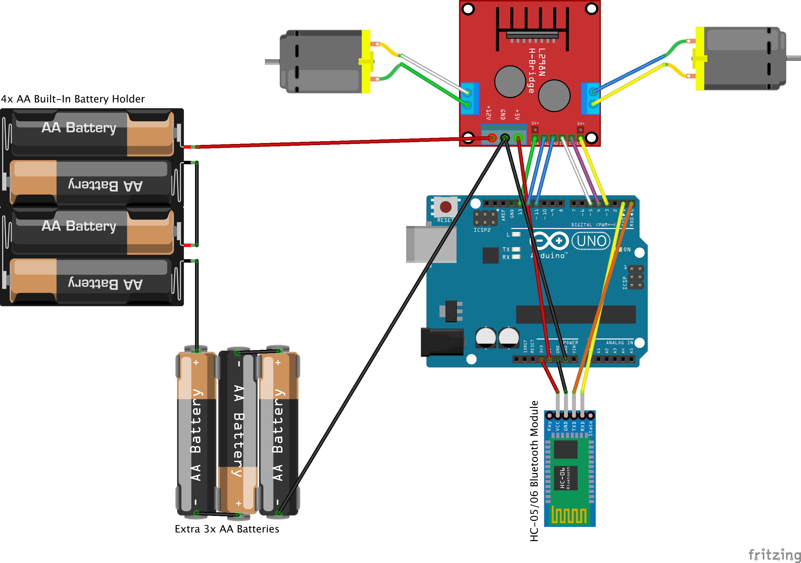

# A Fabian and Rocco Production
**Just your typical keyboard-controlled RC car**

A project by Fabian Yiu and Rocco Jiang.

## Instructions
1. Install the [Arduino](https://www.arduino.cc/en/Main/software) and [Processing](https://processing.org/download/) IDEs.
2. Connect a power source to the Arduino, so the HC-05/HC-06 Bluetooth module is turned on and blinking.
3. The computer should be connected via Bluetooth to HC-05/HC-06 (by default, the password is `1234`).
4. Find the Bluetooth serial port name via the Arduino IDE.
   
   Alternatively, you can list out all serial ports in a terminal window with the command:
   ```
   ls /dev/{tty,cu}.*
   ```
5. Load the Processing sketch in `input/input.pde`, replacing the `port_name` string with the port name found earlier.
6. Turn on the 3xAA battery pack.
7. Run the sketch and wait for 'CLEAR' to appear in the Processing console, signifying that a connection has been made to the serial port. Use arrow keys to control the car.

## Schematic
